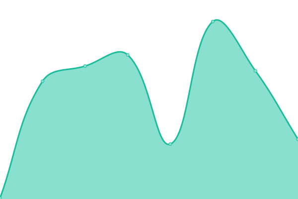

# [📈 Live Status](https://peposhh.github.io/upptime): <!--live status--> **🟧 Partial outage**

This repository contains the open-source uptime monitor and status page for [Jose Daniel Contreras](https://peposhh.github.io/upptime), powered by [Upptime](https://github.com/upptime/upptime).

With [Upptime](https://upptime.js.org), you can get your own unlimited and free uptime monitor and status page, powered entirely by a GitHub repository. We use [Issues](https://github.com/peposhh/upptime/issues) as incident reports, [Actions](https://github.com/peposhh/upptime/actions) as uptime monitors, and [Pages](https://peposhh.github.io/upptime) for the status page.

<!--start: status pages-->
<!-- This summary is generated by Upptime (https://github.com/upptime/upptime) -->
<!-- Do not edit this manually, your changes will be overwritten -->
<!-- prettier-ignore -->
| URL | Status | History | Response Time | Uptime |
| --- | ------ | ------- | ------------- | ------ |
|  [Cinemark Chile](https://promociones.cinemark.cl) | 🟩 Up | [cinemark-chile.yml](https://github.com/peposhh/upptime/commits/HEAD/history/cinemark-chile.yml) | 

 966ms
     
 | 

<a href="https://demo.upptime.js.org/history/cinemark-chile">100.00%</a>
    

|  [Cinemark Paraguay](https://promociones.cinemark.com.py) | 🟩 Up | [cinemark-paraguay.yml](https://github.com/peposhh/upptime/commits/HEAD/history/cinemark-paraguay.yml) | 

 1024ms
     
 | 

<a href="https://demo.upptime.js.org/history/cinemark-paraguay">100.00%</a>
    

|  [Canje GC](https://canje.celmediafidelizacion.cl) | 🟩 Up | [canje-gc.yml](https://github.com/peposhh/upptime/commits/HEAD/history/canje-gc.yml) | 

 817ms
     
 | 

<a href="https://demo.upptime.js.org/history/canje-gc">100.00%</a>
    

|  [Itau beneficios](https://itaubeneficios.cl) | 🟩 Up | [itau-beneficios.yml](https://github.com/peposhh/upptime/commits/HEAD/history/itau-beneficios.yml) | 

 1196ms
     
 | 

<a href="https://demo.upptime.js.org/history/itau-beneficios">100.00%</a>
    

|  [Tienda productos](https://tiendaproductos.cl) | 🟥 Down | [tienda-productos.yml](https://github.com/peposhh/upptime/commits/HEAD/history/tienda-productos.yml) | 

 106ms
     
 | 

<a href="https://demo.upptime.js.org/history/tienda-productos">100.00%</a>
    

|  [Betterfly](https://bfcupon.betterflydescuentos.com) | 🟥 Down | [betterfly.yml](https://github.com/peposhh/upptime/commits/HEAD/history/betterfly.yml) | 

 70ms
     
 | 

<a href="https://demo.upptime.js.org/history/betterfly">100.00%</a>
    

|  [Shellcardtaxi](https://www.tarjeta-taxi.cl) | 🟩 Up | [shellcardtaxi.yml](https://github.com/peposhh/upptime/commits/HEAD/history/shellcardtaxi.yml) | 

 840ms
     
 | 

<a href="https://demo.upptime.js.org/history/shellcardtaxi">100.00%</a>
    

|  [Hazte Cliente empresas](https://hazteclienteempresas.itaubeneficios.cl/) | 🟥 Down | [hazte-cliente-empresas.yml](https://github.com/peposhh/upptime/commits/HEAD/history/hazte-cliente-empresas.yml) | 

 0ms
     
 | 

<a href="https://demo.upptime.js.org/history/hazte-cliente-empresas">0.00%</a>
    

<!--end: status pages-->

[**Visit our status website →**](https://peposhh.github.io/upptime)

## 📄 License

- Powered by: [Upptime](https://github.com/upptime/upptime)
- Code: [MIT](./LICENSE) © [Jose Daniel Contreras](https://peposhh.github.io/upptime)
- Data in the `./history` directory: [Open Database License](https://opendatacommons.org/licenses/odbl/1-0/)
